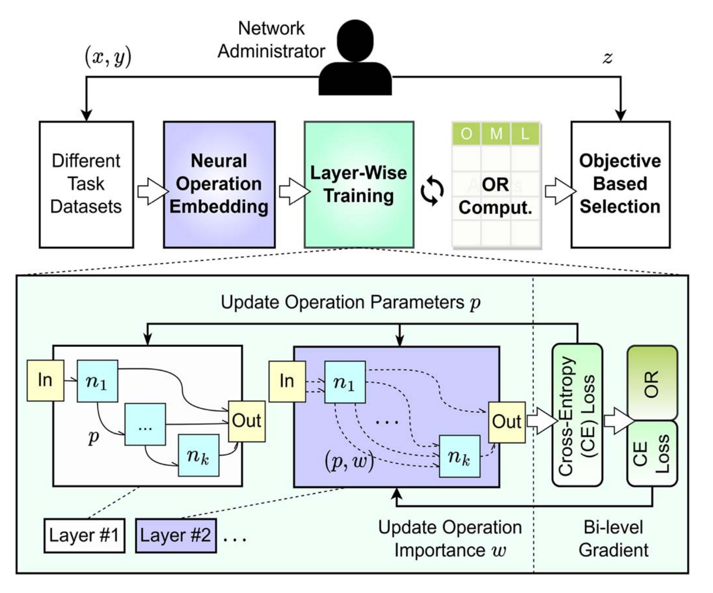

# Loong

Generating neural networks for diverse networking classification tasks via hardware-aware neural architecture search, Transactions on Computers 2023



## Hardware-Aware Neural Architecture Search

To perform Hardware-Aware Neural Architecture Search, run the `train_search.py` script. Adjust the `latency_restrict` parameter according to your specific application and hardware requirements to search for a model within the specified latency limit:

```
python train_search.py --use_loss_regulation True --latency_restrict 5.0
```

The other parameters for the model search process are also provided within the code. The default values are configured as per the experiments detailed in our paper. However, you can modify these parameters flexibly to better suit your particular needs and scenarios. This flexibility ensures that the search process is tailored to your specific constraints and optimizes the model performance for your unique application and hardware environment.

## Hardware Test

### Environment Setup

We provide the necessary MNN dependencies. Please add them to your working directory and ensure they have the correct permissions by executing the following commands:

```shell
chmod -R +x hardware_test/
export PATH=$PATH:~/hardware_test/MNN_build
export LD_LIBRARY_PATH=~/hardware_test/MNN_build:$LD_LIBRARY_PATH
```

Please modify the paths as needed based on your actual directory structure.

### Model preparation

First, obtain the ONNX files by executing the following commands:

```shell
cd hardware_test
python ./run_exp/get_model/get_models.py
```

Next, move the ONNX files to the `run_exp/ONNX` directory and write the names of all ONNX files into the `run_exp/ac.log` file:

```python
UNIBS_latency__1_batch_size_1.onnx
UNIBS_latency__2_batch_size_1.onnx
UNIBS_latency__3_batch_size_1.onnx
UNIBS_latency__4_batch_size_1.onnx
UNIBS_latency__5_batch_size_1.onnx
UNIBS_latency__6_batch_size_1.onnx
UNIBS_latency__7_batch_size_1.onnx
UNIBS_latency__8_batch_size_1.onnx
UNIBS_latency__9_batch_size_1.onnx
UNIBS_latency__10_batch_size_1.onnx
```

### Test Model

Finally, run the `run_exp/run_exp.sh` script to obtain the test results:

```shell
cd run_exp
./run_exp.sh
```

The results will be saved in `result.txt`, and detailed logs will be stored in the `time` directory.
